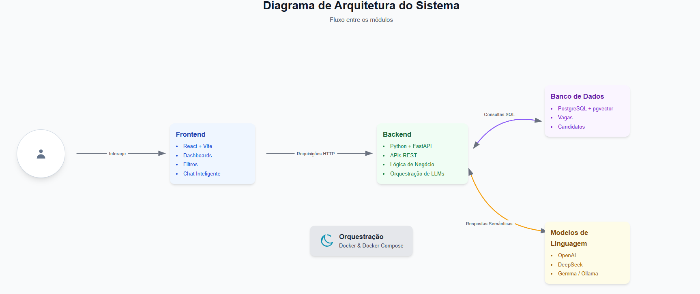

# Datathon Decision

Projeto desenvolvido para o **Datathon FIAP**, focado em automação e inteligência na análise de currículos, gestão de vagas e recomendação de candidatos utilizando modelos de linguagem (LLMs) e análise semântica.



---

## 🎯 Objetivo

Resolver o principal desafio do recrutamento moderno: lidar com grandes volumes de currículos e identificar rapidamente os melhores candidatos para cada vaga. Automatiza a triagem, recomendação e análise semântica dos perfis, reduzindo tempo, custos e vieses por meio de um **backend** robusto e um **frontend** intuitivo.

---

## 🛠 Tecnologias Utilizadas

### Frontend

- React 18+
- Vite
- TypeScript
- Tailwind CSS
- Axios (requisições HTTP)
- ESLint (linting)
- Docker (opcional para deploy)

### Backend

- Python 3.11+
- FastAPI (framework web)
- SQLAlchemy (ORM)
- Pydantic (validação de dados)
- Uvicorn (ASGI server)
- PostgreSQL (banco de dados relacional) com extensão pgvector para suporte a vetores (busca vetorial)
- Pandas e NumPy (manipulação e análise de dados)
- Requests e HTTPX (requisições HTTP síncronas e assíncronas)
- OpenAI, DeepSeek, Gemma 3, Ollama (integração com LLMs)
- Docker (containerização)
- Pytest (testes automatizados)
- python-dotenv (gerenciamento de variáveis de ambiente)

---

## 📂 Estrutura do Projeto

```bash
├── backend/               # Código do backend, APIs, modelos, serviços e testes
├── frontend/              # Interface web, componentes, serviços e assets
├── database/              # Scripts de criação e migração de esquema (database_schema.sql)
├── notebooks/             # Análises, experimentos e validações
├── docs/                  # Documentação técnica e de APIs
├── data/                  # Dados de entrada e exemplos
└── docker-compose.yml     # Orquestração de containers para ambiente completo
```

---

## 📓 Notebooks do Projeto

Os notebooks utilizados no desenvolvimento do projeto estão localizados na pasta `notebooks/`. Cada notebook tem um papel específico no pipeline de análise semântica, extração de dados e avaliação do desempenho do modelo.

### ▶️ `Normalizacao_CV_Gemma_v1.ipynb`
Responsável por extrair e estruturar informações de currículos (formações, experiências, habilidades, idiomas) usando o modelo Gemma via Ollama. Salva os dados tratados na tabela `processed_applicants`.

### 🔍 `Pesquisa_Semantica_Teste.ipynb`
Realiza testes de busca semântica para comparar candidatos e vagas com base em similaridade vetorial, verificando a qualidade da recomendação.

### 📊 `Avaliacao_PesquisaSemantica.ipynb`
Avalia a performance do sistema de recomendação:
- Calcula métricas como posição média, mediana, Top 1, Top 3, Top 5 e Top 10
- Interpreta os resultados dos candidatos aprovados
- Valida se a priorização dos melhores candidatos está eficaz

### 🧾 `Tratamento_semantico.ipynb`
Transforma o JSON estruturado dos currículos em texto semântico descritivo, usado posteriormente na geração de embeddings para comparação.

### 🧾 `Tratamento_Semantico_Vaga.ipynb`
Faz o tratamento e normalização textual das descrições de vagas, convertendo para texto semântico no mesmo formato dos candidatos.

---

## ⚙️ Instalação e Execução

Siga os passos abaixo para configurar e rodar toda a aplicação em containers:

1. **Criar o banco de dados**:

```bash
psql -f database/database_schema.sql
psql -c "CREATE EXTENSION IF NOT EXISTS vector;"  # instala a extensão pgvector para buscas vetoriais
```

2. **Configurar variáveis de ambiente**:

- **Backend**: copie `backend/.env.example` para `backend/.env` e ajuste conforme necessário (ex: `DATABASE_URL`, `OLLAMA_MODEL`, `OPENAI_API_KEY`).
- **Frontend**: copie `frontend/.env.example` para `frontend/.env` e defina:
  ```ini
  VITE_API_BASE_URL=https://seu-backend.com
  ```

3. **Consultar READMEs específicos**:

- Leia `backend/README.md` para instruções detalhadas de instalação e execução do backend.
- Leia `frontend/README.md` para instruções de build e execução do frontend.

4. **Subir containers com Docker Compose**:

```bash
docker-compose up --build
```

5. **Acessar a aplicação**:

- Frontend: `http://localhost:5173`
- Backend: `http://localhost:8000` (docs em `http://localhost:8000/docs`)

---

## 📄 Licença

Este projeto está licenciado sob a **MIT License**. Consulte o arquivo [LICENSE](LICENSE) para mais detalhes.

---

## Autor

[](https://www.linkedin.com/in/victor-hugo-teles-de-santana-359ba260/) Victor H T Santana.
