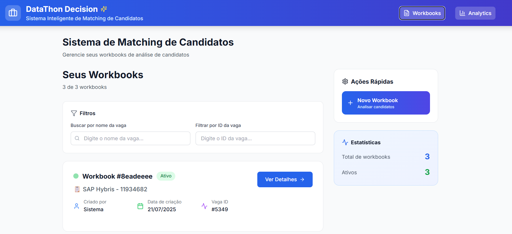
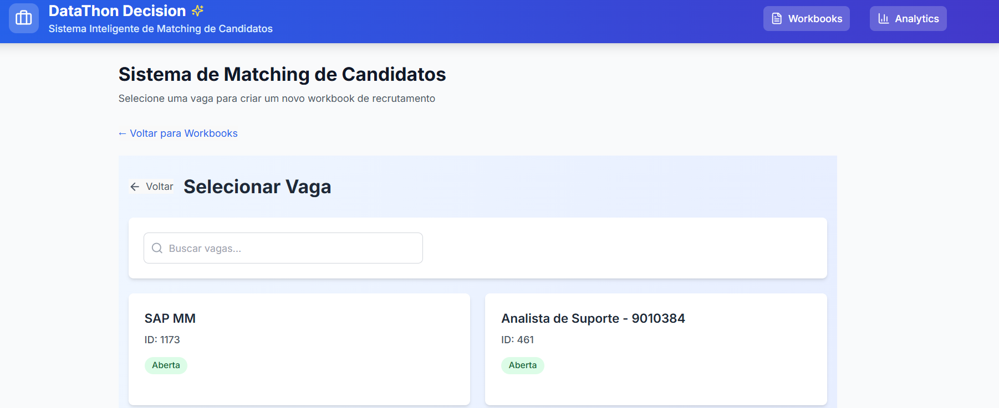
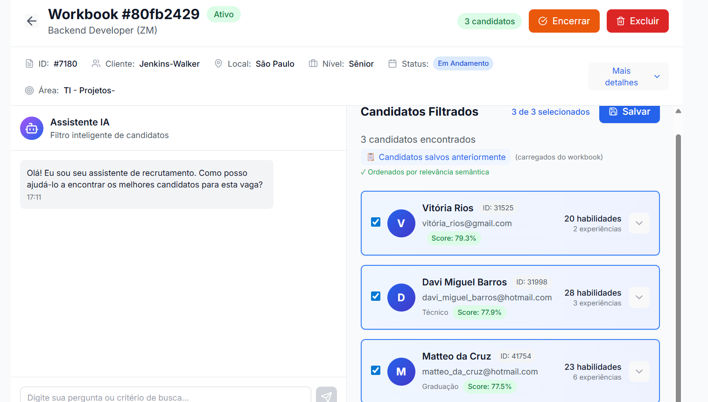
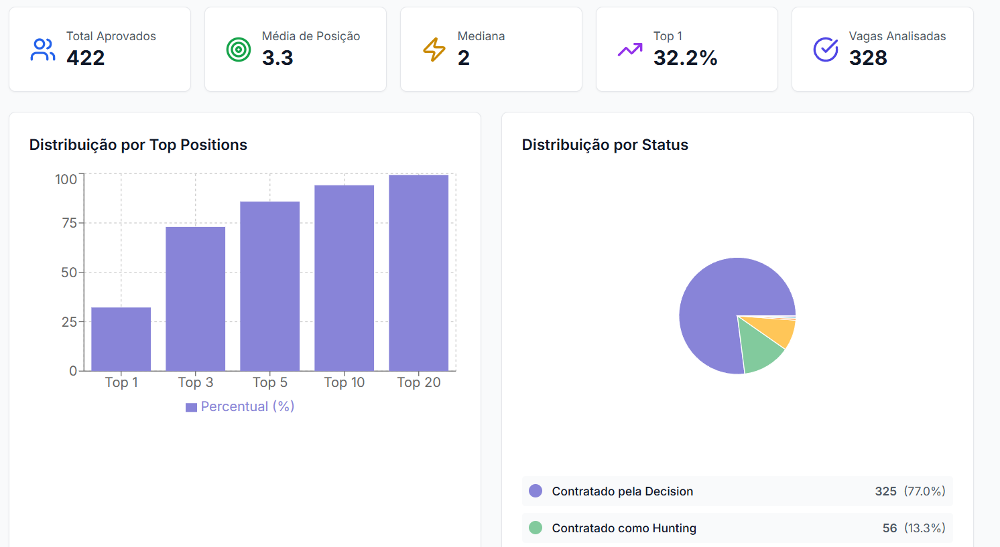

# Datathon Decision – Frontend

O frontend do **Datathon Decision** é uma aplicação web desenvolvida em React, com Vite para build e desenvolvimento rápido e Tailwind CSS para estilização moderna e responsiva. Seu objetivo principal é prover uma interface intuitiva para interação com o backend, permitindo visualizar, filtrar e analisar candidatos e vagas, além de oferecer chat integrado com LLM para análise semântica.

---

## 🛠 Tecnologias Utilizadas

- **React 18+**
- **Vite**
- **TypeScript**
- **Tailwind CSS**
- **Axios** (requisições HTTP)
- **ESLint** (linting)
- **Docker** (opcional para deploy)

---

## 📁 Estrutura de Pastas

```
├── public/                # Recursos estáticos
└── src/
    ├── components/        # Componentes React reutilizáveis
    ├── services/          # Integração com APIs do backend
    ├── hooks/             # Hooks customizados
    ├── types/             # Tipos TypeScript
    ├── App.tsx            # Componente raiz
    ├── main.tsx           # Ponto de entrada
    └── index.css          # Estilos globais
```

---

## ⚙️ Configuração de Ambiente

Antes de iniciar o aplicativo, crie um arquivo `.env` na raiz do projeto e defina a variável de ambiente:

```ini
VITE_API_BASE_URL=https://api.seu-dominio.com  # URL base do backend para onde o frontend fará requisições
```

---

## 🖼️ Telas da Aplicação

A seguir, as principais telas da aplicação. Insira os prints de tela nos locais indicados.

### 1. Página Inicial de Workbooks

Descrição: Visão geral dos seus workbooks de análise. Inclui filtros por nome e ID de vagas, ações rápidas (criar novo workbook) e estatísticas gerais.



### 2. Seleção de Vaga (Novo Workbook)

Descrição: Após clicar em **Novo Workbook**, selecione a vaga desejada usando o campo de busca. Cada cartão de vaga exibe título da vaga, ID e status.



### 3. Tela de Detalhes do Workbook e Chat Semântico

Descrição: Na tela de detalhes do workbook, é possível iniciar a busca semântica via chat com IA, filtrar e selecionar candidatos com base em linguagem natural.



### 4. Dashboard de Analytics

Descrição: Página de **Analytics** para monitorar a solução. Os gráficos mostram métricas de performance semântica, como posição histórica dos candidatos contratados.



---

